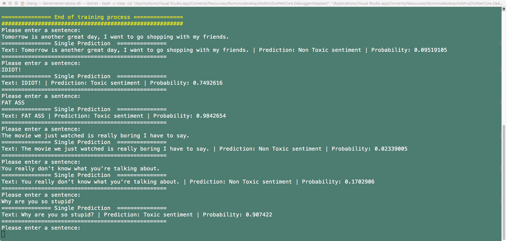

# csharp-playground

This repo is intend to host some of the interesting .net project I have done myself.

## Sentiment Analysis

Sentiment analyisis is an interesting machine learning task, the input for this task is a sentense and the output is a boolean indicating if the sentense is toxic or not.

wikiDetoxAnnotated40kRows data set is used in this task, and the FastTree model from ML.NET is used as the model. Here's some interesting results:

